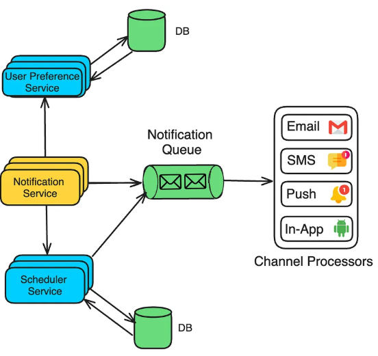
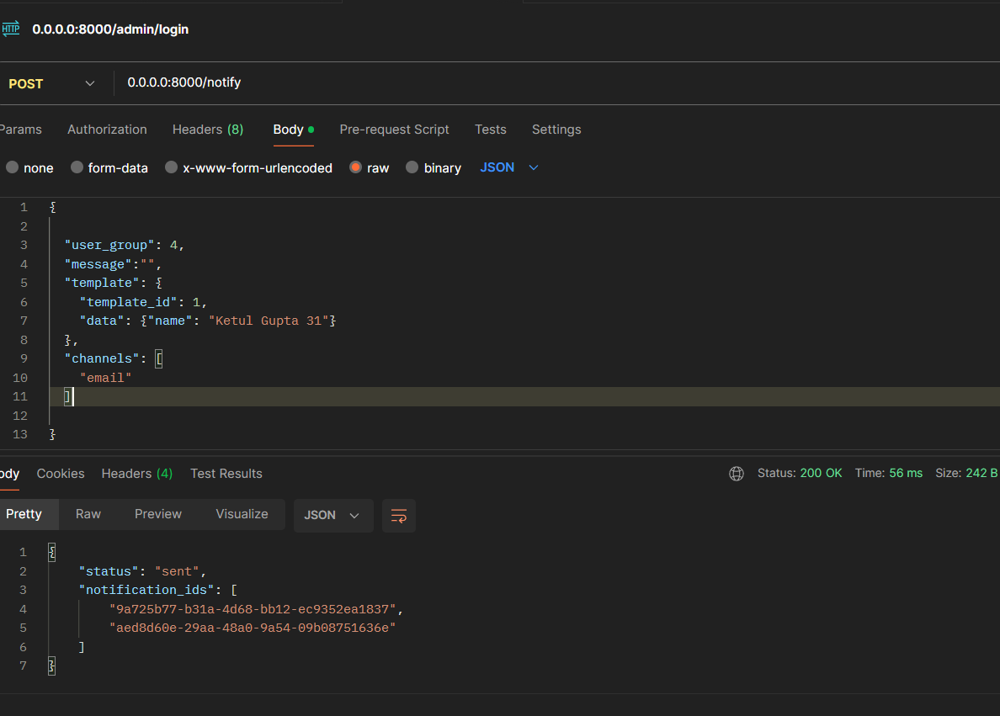
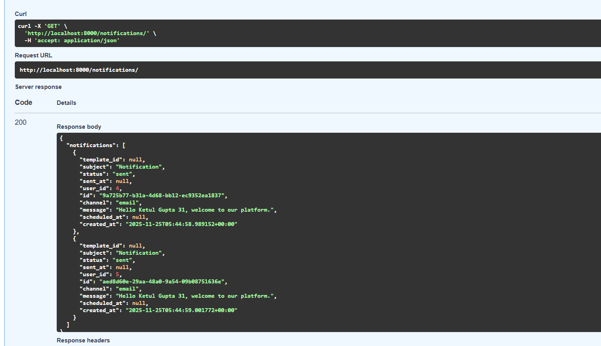
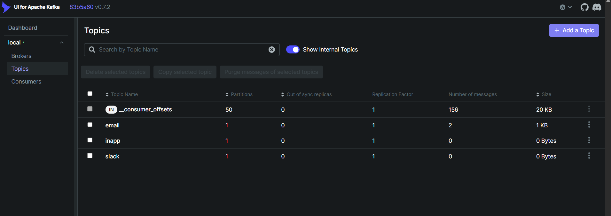
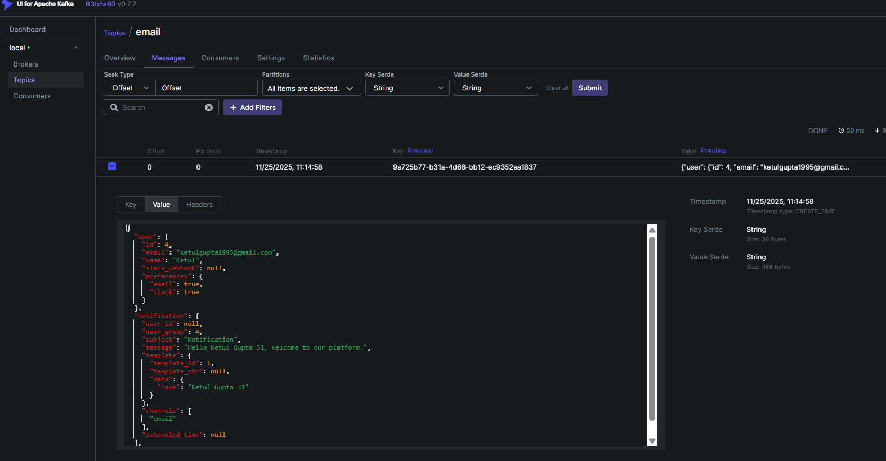

Goal:

Your task is to develop a notification service that facilitates the sending of
various types of notifications, including email, Slack, and in-app notifications.


Requirements

1. Notification Types
    Implement the functionality to send notifications through different channels:
    1. Emails
    2. Slack messages
    3. In-app notifications


2. Channel Mapping
    Based on the type of notification, ensure that the appropriate channel is used for delivery.
    For example, certain notifications should be routed to email, while others may be directed to Slack or presented as in-app notifications.


3. Notification Scheduling
    - Allow for notifications to be scheduled based on user-defined criteria.
    - Some notifications should be sent instantly, while others can be scheduled for a later time.


4. Notification Templates
    - Support for predefined notification templates, as well as the flexibility for users to define their own templates for notifications.


5. Flexibility and Creativity
    - This assignment is intentionally broad to allow you the creative freedom to make design choices and implement features as you see fit.
    Additional Considerations
    - You are encouraged to explore and utilize open-source third-party tools and libraries to
    enhance your implementation.
    - Please adhere to best practices in system design and coding.


Architecuture Diagram



Technologies Used
- Python (FastAPI)
- SQLAlchemy (Postgres) asyncpg + psycopg2
- Kafka (aiokafka)
- Docker & Docker-Compose


Setup Instructions
1. Clone the repository:
   ```
   git clone <repository_url>
   cd <repository_directory>
   ```  
2. have docker and docker-compose installed on your machine.
3. Build and run the Docker containers:
   ```
   docker-compose up --build
   ```  
4. Access the application at `http://localhost:8000`.
5. API Documentation is available at `http://localhost:8000/docs`.
6. Kafa ui is available at `http://localhost:8080`.
7. Database access using `http://localhost:3000/` .

for application logs use:
    ```
    docker-compose logs -f web
    ```

API Endpoints
- POST /notifications
    - Description: Create a new notification.
    - Request Body: {
        "user_id": int,
        "type": "email" | "slack" | "in-app",
        "content": str,
        "scheduled_time": datetime (optional)
      }     


# Notification Service Database Schema

This schema defines the tables and relationships for a notification service that supports multiple channels (email, Slack, in-app).

---

## Users Table

Stores information about users and their preferences.

| Column          | Type    | Constraints              | Description                                |
|-----------------|--------|-------------------------|--------------------------------------------|
| `id`            | Integer | Primary Key            | Unique identifier for the user             |
| `group_id`      | Integer | Nullable               | Optional group association                 |
| `email`         | String  | Unique, Nullable       | User's email address                        |
| `name`          | String  | Not Nullable           | User's full name                            |
| `slack_webhook` | String  | Nullable               | Slack webhook URL for notifications        |
| `preferences`   | JSON    | Default `{}`           | User-specific preferences                  |

---

## Templates Table

Stores notification templates for different channels.

| Column            | Type   | Constraints         | Description                                           |
|------------------|-------|-------------------|-------------------------------------------------------|
| `id`             | Integer | Primary Key       | Unique template identifier                            |
| `name`           | String  | Unique            | Template name                                         |
| `channel`        | String  | Not Nullable      | Notification channel (`email`, `slack`, `in_app`, `multi`) |
| `subject_template` | String | Nullable          | Template for subject (used for emails)               |
| `body_template`  | Text    | Not Nullable      | Template for message body                             |
| `is_default`     | Boolean | Default `False`   | Indicates if this is the default template            |

---

## Notifications Table

Stores individual notification instances for users.

| Column        | Type      | Constraints                     | Description                                           |
|---------------|----------|---------------------------------|-------------------------------------------------------|
| `id`          | String   | Primary Key                    | Unique notification identifier                        |
| `channel`     | String   | Primary Key                    | Notification channel (`email`, `slack`, `in_app`)     |
| `user_id`     | Integer  | Foreign Key → `users.id`       | User receiving the notification                      |
| `template_id` | Integer  | Foreign Key → `templates.id`, Nullable | Template used for this notification (optional)       |
| `subject`     | String   | Default `{}`                   | Notification subject                                  |
| `message`     | String   | Default `{}`                   | Notification message                                  |
| `scheduled_at`| DateTime | Nullable                       | Scheduled send time                                   |
| `status`      | String   | Default `"pending"`            | Notification status (`pending`, `sent`, etc.)        |
| `created_at`  | DateTime | Default current timestamp      | Time of creation                                     |
| `sent_at`     | DateTime | Nullable                       | Time when notification was sent                      |

### Relationships

- `Notification.user` → references `User`
- `Notification.template` → references `Template`


output
Create Notification API 



Created Notification Table



Kafka Producer to send message to topic



Producer topic messages



